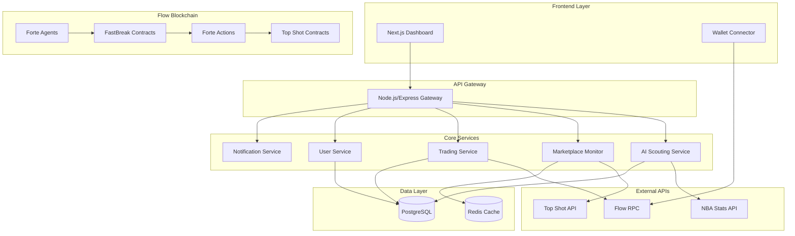
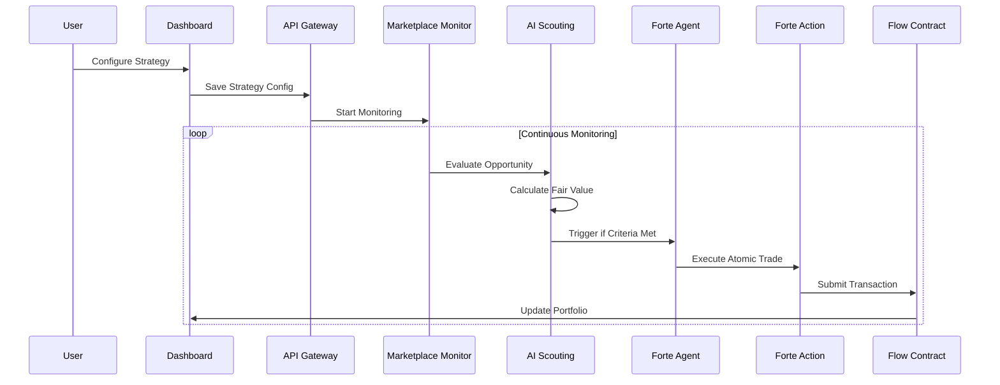

# FastBreak Design Document

## Overview

FastBreak is a sophisticated dApp that combines AI-powered market analysis with automated trading execution on the Flow blockchain. The system architecture follows a microservices pattern with clear separation between the frontend dashboard, AI analysis engine, blockchain interaction layer, and real-time monitoring components.

The design leverages Flow's unique multi-role architecture and resource-oriented programming model through Cadence smart contracts, while integrating with Forte's Agent and Action framework for automated execution. The system prioritizes security, transparency, and user control while providing intelligent automation for NBA Top Shot moment trading.

## Architecture

### High-Level Architecture



### Component Interaction Flow



## Components and Interfaces

### Frontend Components

#### Dashboard Interface
- **Technology**: Next.js 14 with App Router, React 18, Tailwind CSS
- **Key Components**:
  - Portfolio Overview with real-time value updates
  - Strategy Configuration Panel with form validation
  - Trade History with AI reasoning display
  - Budget Controls with visual spending indicators
  - Leaderboard with anonymized user rankings

#### Wallet Integration
- **Technology**: Flow Client Library (FCL)
- **Functionality**:
  - Secure wallet connection with multiple provider support
  - Transaction signing and verification
  - Balance monitoring and display
  - Multi-signature support for enhanced security

### Backend Services

#### AI Scouting Service
- **Technology**: FastAPI with Python, scikit-learn, pandas
- **Core Functions**:
  - Player performance analysis using NBA stats
  - Market sentiment analysis from social media feeds
  - Price prediction models using historical data
  - Anomaly detection for identifying undervalued moments
- **API Endpoints**:
  - `POST /analyze/moment` - Evaluate specific moment value
  - `GET /strategies/{user_id}` - Retrieve user strategies
  - `POST /strategies` - Create/update scouting strategies

#### Marketplace Monitor Service
- **Technology**: Node.js with TypeScript, WebSocket connections
- **Core Functions**:
  - Real-time marketplace data ingestion
  - Price change detection and alerting
  - Arbitrage opportunity identification
  - Market depth analysis for liquidity assessment
- **API Endpoints**:
  - `GET /markets/opportunities` - Current arbitrage opportunities
  - `POST /monitors` - Configure monitoring parameters
  - `GET /prices/history/{moment_id}` - Historical price data####
 Trading Service
- **Technology**: Node.js with TypeScript, Flow SDK
- **Core Functions**:
  - Transaction composition and validation
  - Risk management and safety checks
  - Portfolio tracking and performance calculation
  - Integration with Forte Actions for atomic execution
- **API Endpoints**:
  - `POST /trades/execute` - Execute automated trade
  - `GET /portfolio/{user_id}` - Portfolio summary and holdings
  - `POST /limits` - Configure trading limits and safety rules

#### User Service
- **Technology**: Node.js with TypeScript, JWT authentication
- **Core Functions**:
  - User registration and profile management
  - Strategy configuration persistence
  - Notification preferences management
  - Leaderboard ranking calculation
- **API Endpoints**:
  - `POST /users/register` - User registration
  - `GET /users/profile` - User profile and settings
  - `PUT /users/strategies` - Update user strategies

### Blockchain Components

#### FastBreak Smart Contracts (Cadence)
- **Core Contract**: `FastBreakController.cdc`
  - User strategy storage and validation
  - Budget limit enforcement
  - Trade execution authorization
  - Portfolio state management

- **Safety Contract**: `SafetyControls.cdc`
  - Multi-signature requirements for large trades
  - Emergency pause functionality
  - Spending limit enforcement
  - Suspicious activity detection

- **Analytics Contract**: `TradeAnalytics.cdc`
  - Trade history recording
  - Performance metrics calculation
  - Leaderboard data aggregation

#### Forte Integration
- **Agents Configuration**:
  - Game Event Agent: Monitors NBA game results and player performances
  - Price Alert Agent: Tracks significant price movements
  - Arbitrage Agent: Identifies cross-marketplace opportunities
  - Daily Scan Agent: Performs scheduled market analysis

- **Actions Composition**:
  - Purchase Action: Atomic bid placement and moment transfer
  - Arbitrage Action: Simultaneous buy/sell across marketplaces
  - Portfolio Rebalance Action: Automated selling based on strategy rules

## Data Models

### User Data Model
```typescript
interface User {
  id: string;
  walletAddress: string;
  strategies: Strategy[];
  budgetLimits: BudgetLimits;
  notificationPreferences: NotificationSettings;
  createdAt: Date;
  lastActive: Date;
}

interface Strategy {
  id: string;
  type: 'rookie_risers' | 'post_game_spikes' | 'arbitrage_mode';
  parameters: StrategyParameters;
  isActive: boolean;
  performance: StrategyPerformance;
}

interface BudgetLimits {
  dailySpendingCap: number;
  maxPricePerMoment: number;
  totalBudgetLimit: number;
  emergencyStopThreshold: number;
}
```

### Moment Data Model
```typescript
interface Moment {
  id: string;
  playerId: string;
  playerName: string;
  gameDate: Date;
  momentType: string;
  serialNumber: number;
  currentPrice: number;
  aiValuation: number;
  confidence: number;
  marketplaceId: string;
  scarcityRank: number;
}

interface Trade {
  id: string;
  userId: string;
  momentId: string;
  action: 'buy' | 'sell';
  price: number;
  timestamp: Date;
  reasoning: string;
  strategyUsed: string;
  profitLoss?: number;
  transactionHash: string;
}
```

### AI Analysis Data Model
```typescript
interface AIAnalysis {
  momentId: string;
  fairValue: number;
  confidence: number;
  factors: AnalysisFactor[];
  recommendation: 'buy' | 'hold' | 'sell' | 'skip';
  riskScore: number;
  timestamp: Date;
}

interface AnalysisFactor {
  type: 'player_performance' | 'market_trend' | 'scarcity' | 'social_sentiment';
  weight: number;
  value: number;
  description: string;
}
```

## Error Handling

### Blockchain Error Handling
- **Transaction Failures**: Implement retry logic with exponential backoff
- **Network Congestion**: Queue transactions and execute when gas costs are optimal
- **Smart Contract Errors**: Parse error messages and provide user-friendly explanations
- **Wallet Disconnection**: Graceful degradation with reconnection prompts

### AI Service Error Handling
- **API Rate Limits**: Implement request queuing and caching strategies
- **Model Failures**: Fallback to simpler heuristic-based analysis
- **Data Quality Issues**: Validate input data and skip analysis if confidence is too low
- **Service Unavailability**: Cache recent analyses and use stale data with appropriate warnings

### Marketplace Error Handling
- **API Downtime**: Switch to backup data sources and cached information
- **Price Feed Delays**: Use multiple price sources and detect anomalies
- **Listing Unavailability**: Verify moment availability before executing trades
- **Rate Limiting**: Implement intelligent request spacing and priority queuing## 
Testing Strategy

### Unit Testing
- **Frontend**: Jest and React Testing Library for component testing
- **Backend Services**: Jest with supertest for API endpoint testing
- **Smart Contracts**: Cadence testing framework for contract logic validation
- **AI Models**: Python unittest with mock data for model accuracy testing

### Integration Testing
- **API Integration**: Test service-to-service communication with test databases
- **Blockchain Integration**: Use Flow testnet for end-to-end transaction testing
- **External API Integration**: Mock NBA Stats and Top Shot APIs for reliable testing
- **Forte Integration**: Test Agent triggers and Action execution in sandbox environment

### End-to-End Testing
- **User Workflows**: Playwright for complete user journey testing
- **Trading Scenarios**: Simulate market conditions and verify automated responses
- **Safety Controls**: Test budget limits, emergency stops, and error conditions
- **Performance Testing**: Load testing for high-frequency trading scenarios

### Security Testing
- **Smart Contract Auditing**: Formal verification of Cadence contracts
- **API Security**: OWASP testing for common vulnerabilities
- **Wallet Security**: Test transaction signing and authorization flows
- **Data Privacy**: Verify user data protection and anonymization

## Performance Considerations

### Scalability Design
- **Horizontal Scaling**: Microservices architecture allows independent scaling
- **Database Optimization**: Read replicas for analytics, write optimization for trades
- **Caching Strategy**: Redis for frequently accessed market data and user sessions
- **CDN Integration**: Static asset delivery and API response caching

### Real-time Requirements
- **WebSocket Connections**: Maintain persistent connections for live price updates
- **Event-Driven Architecture**: Use message queues for decoupled service communication
- **Batch Processing**: Group similar operations to reduce blockchain transaction costs
- **Predictive Caching**: Pre-load likely trading opportunities based on user strategies

### Monitoring and Observability
- **Application Metrics**: Track API response times, error rates, and user engagement
- **Business Metrics**: Monitor trading success rates, profit/loss, and user satisfaction
- **Blockchain Metrics**: Track transaction success rates, gas costs, and confirmation times
- **AI Model Performance**: Monitor prediction accuracy and model drift over time

## Security Architecture

### Authentication and Authorization
- **Wallet-Based Authentication**: Use Flow wallet signatures for user verification
- **JWT Tokens**: Secure API access with short-lived tokens and refresh mechanisms
- **Role-Based Access**: Different permission levels for users, admins, and system services
- **Multi-Factor Authentication**: Optional 2FA for high-value account protection

### Data Protection
- **Encryption at Rest**: AES-256 encryption for sensitive user data and trading strategies
- **Encryption in Transit**: TLS 1.3 for all API communications
- **Key Management**: Hardware security modules for private key protection
- **Data Anonymization**: Remove PII from analytics and leaderboard data

### Smart Contract Security
- **Access Controls**: Restrict contract functions to authorized users and services
- **Reentrancy Protection**: Implement checks-effects-interactions pattern
- **Integer Overflow Protection**: Use safe math libraries for all calculations
- **Emergency Controls**: Admin functions for pausing contracts in case of exploits

### Operational Security
- **Infrastructure Security**: Container scanning, network segmentation, and intrusion detection
- **API Rate Limiting**: Prevent abuse and ensure fair resource allocation
- **Audit Logging**: Comprehensive logging of all user actions and system events
- **Incident Response**: Automated alerting and response procedures for security events

## Deployment Architecture

### Development Environment
- **Local Development**: Docker Compose for full stack local development
- **Flow Emulator**: Local blockchain for contract development and testing
- **Mock Services**: Simulated external APIs for offline development

### Staging Environment
- **Flow Testnet**: Full blockchain integration testing
- **Production-like Data**: Anonymized production data for realistic testing
- **Performance Testing**: Load testing with production-scale data volumes

### Production Environment
- **Multi-Region Deployment**: Primary and backup regions for high availability
- **Auto-scaling**: Kubernetes for container orchestration and scaling
- **Database Clustering**: PostgreSQL with read replicas and automated failover
- **Monitoring Stack**: Prometheus, Grafana, and custom dashboards for system health