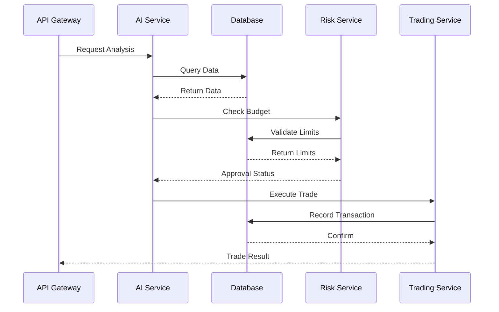

# System Integration Fixes Design

## Overview

This design addresses the critical integration issues preventing the FastBreak system from functioning as a cohesive unit. The focus is on fixing the database layer exports, resolving package dependencies, and establishing proper service-to-service communication patterns.

## Architecture

### Database Layer Architecture

```mermaid
graph TB
    subgraph "Database Package (@fastbreak/database)"
        DM[DatabaseManager]
        REPO[Repository Classes]
        TYPES[Type Definitions]
        MIGRATIONS[Migration Scripts]
    end
    
    subgraph "Services"
        AI[AI Scouting]
        RISK[Risk Management]
        STRATEGY[Strategy Service]
        FORTE[Forte Agents]
        TRADING[Trading Service]
    end
    
    subgraph "Shared Packages"
        TYPES_PKG[@fastbreak/types]
        MONITOR[@fastbreak/monitoring]
        SHARED[@fastbreak/shared]
    end
    
    DM --> REPO
    REPO --> TYPES
    
    AI --> DM
    RISK --> DM
    STRATEGY --> DM
    FORTE --> DM
    TRADING --> DM
    
    AI --> TYPES_PKG
    RISK --> TYPES_PKG
    STRATEGY --> TYPES_PKG
    
    AI --> MONITOR
    RISK --> MONITOR
    STRATEGY --> MONITOR
```

### Service Communication Pattern



## Components and Interfaces

### Database Manager Interface

```typescript
export interface DatabaseManager {
  initialize(): Promise<void>;
  getConnection(): Pool;
  close(): Promise<void>;
  
  // Repository access
  getBudgetLimitsRepository(): BudgetLimitsRepository;
  getSpendingTrackerRepository(): SpendingTrackerRepository;
  getStrategyRepository(): StrategyRepository;
  getEmergencyStopRepository(): EmergencyStopRepository;
  getRiskAlertRepository(): RiskAlertRepository;
}
```

### Repository Base Interface

```typescript
export interface BaseRepository<T> {
  create(data: Omit<T, 'id' | 'createdAt' | 'updatedAt'>): Promise<T>;
  findById(id: string): Promise<T | null>;
  update(id: string, data: Partial<T>): Promise<T>;
  delete(id: string): Promise<boolean>;
  findMany(criteria: Partial<T>): Promise<T[]>;
}
```

### Service Configuration Interface

```typescript
export interface ServiceConfig {
  database: {
    url: string;
    poolSize: number;
    timeout: number;
  };
  redis: {
    url: string;
    keyPrefix: string;
  };
  monitoring: {
    enabled: boolean;
    logLevel: string;
    correlationIdHeader: string;
  };
}
```

## Data Models

### Database Connection Configuration

```typescript
interface DatabaseConfig {
  host: string;
  port: number;
  database: string;
  username: string;
  password: string;
  ssl: boolean;
  poolSize: number;
  connectionTimeout: number;
  idleTimeout: number;
}
```

### Service Health Status

```typescript
interface ServiceHealth {
  service: string;
  status: 'healthy' | 'degraded' | 'unhealthy';
  timestamp: Date;
  dependencies: {
    database: 'connected' | 'disconnected' | 'error';
    redis: 'connected' | 'disconnected' | 'error';
    externalAPIs: Record<string, 'available' | 'unavailable' | 'error'>;
  };
  metrics: {
    uptime: number;
    memoryUsage: number;
    cpuUsage: number;
    requestCount: number;
    errorRate: number;
  };
}
```

## Error Handling Strategy

### Database Error Handling

- **Connection Failures**: Implement retry logic with exponential backoff
- **Query Timeouts**: Set appropriate timeouts and provide fallback responses
- **Transaction Failures**: Proper rollback and error reporting
- **Migration Errors**: Clear error messages and rollback procedures

### Service Communication Error Handling

- **Network Failures**: Circuit breaker pattern for service calls
- **Timeout Handling**: Configurable timeouts with graceful degradation
- **Rate Limiting**: Implement backoff strategies for rate-limited APIs
- **Service Unavailability**: Fallback mechanisms and cached responses

### Monitoring and Logging

- **Structured Logging**: Consistent log format across all services
- **Correlation IDs**: Track requests across service boundaries
- **Error Aggregation**: Centralized error collection and analysis
- **Performance Metrics**: Track response times, error rates, and throughput

## Implementation Strategy

### Phase 1: Database Layer Foundation
1. Create proper exports in database package index file
2. Implement missing repository classes
3. Add comprehensive type definitions
4. Fix compilation errors

### Phase 2: Package Dependencies
1. Create @fastbreak/monitoring package
2. Ensure @fastbreak/types is properly structured
3. Update package.json dependencies across all services
4. Verify cross-package imports work correctly

### Phase 3: Service Integration
1. Implement API Gateway service discovery
2. Add proper health check endpoints
3. Implement service-to-service communication patterns
4. Add comprehensive error handling

### Phase 4: Runtime Configuration
1. Create proper environment configuration
2. Add Docker Compose orchestration
3. Implement startup dependency management
4. Add development and production configurations

## Testing Strategy

### Unit Testing
- Test database repository methods with mock data
- Test service initialization and configuration
- Test error handling scenarios
- Test type definitions and interfaces

### Integration Testing
- Test database connections and queries
- Test service-to-service communication
- Test error propagation and handling
- Test configuration loading and validation

### System Testing
- Test complete service startup sequence
- Test end-to-end request flows
- Test failure scenarios and recovery
- Test performance under load

## Security Considerations

### Database Security
- Use connection pooling with proper limits
- Implement query parameterization to prevent SQL injection
- Use encrypted connections (SSL/TLS)
- Implement proper access controls

### Service Communication Security
- Use API keys for service-to-service authentication
- Implement request signing for critical operations
- Use HTTPS for all external communications
- Implement rate limiting and DDoS protection

### Configuration Security
- Store sensitive configuration in environment variables
- Use secrets management for production deployments
- Implement configuration validation
- Avoid hardcoded credentials in code

## Performance Considerations

### Database Performance
- Implement connection pooling
- Use read replicas for analytics queries
- Implement query optimization and indexing
- Add database query monitoring

### Service Performance
- Implement caching strategies (Redis)
- Use async/await patterns for I/O operations
- Implement request batching where appropriate
- Add performance monitoring and alerting

### Scalability Design
- Design for horizontal scaling
- Implement stateless service patterns
- Use message queues for async processing
- Plan for load balancing and auto-scaling